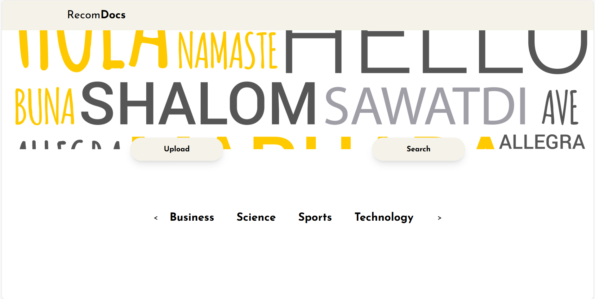

## Description
A documents recommendation system based on DistilBERT vectors and Cosine similarity

## Preparing the environment 
## [📺 ➡️ Installation guide](https://www.youtube.com/watch?v=CrKDEnC-S7o&feature=youtu.be)
to run this app, open terminal or cmd and do as follow :

git clone https://github.com/nourhanekefsi/project-nlp.git

pip install -r requirements.txt

Ensure the following Python libraries are installed: 
FastAPI 
nltk 
matplotlib 
wordcloud 
scikit-learn 
pandas 
numpy ...

## Run the app
1st of all in the terminal run 

cd project-nlp/backend/APIs

uvicorn main:app --reload

open another tab of terminal

cd project-nlp/frontend

npm install

npm start
